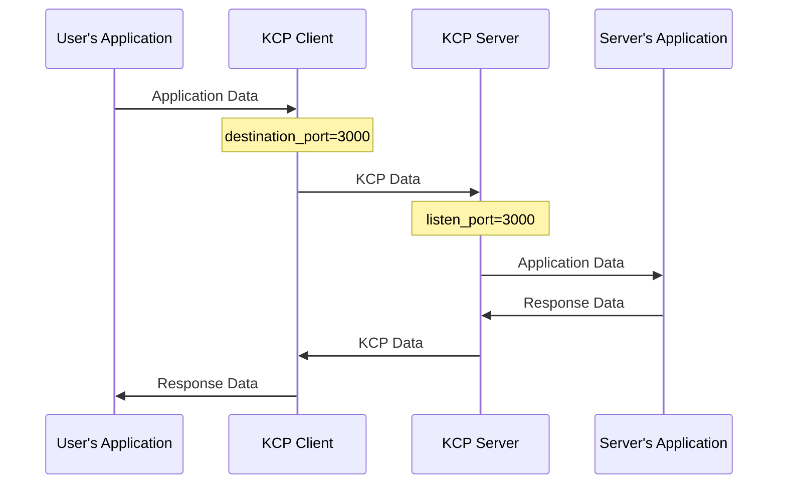

# KCP Tube General Configurations

## Basic Configuration File
Here is the most basic configuration file, which can be modified according to personal needs.

In this mode, the server only provides a single port connection. However, in order to avoid QoS as much as possible, the client will still try to change the sending port every 1 minute (unless this option is disabled by setting dport_refresh to 0).

Example of client mode:
```
mode=client
kcp=regular3
inbound_bandwidth=500M
outbound_bandwidth=50M
listen_port=59000
destination_port=3000
destination_address=123.45.67.89
encryption_password=qwerty1234
encryption_algorithm=AES-GCM
```

Example of server mode:
```
mode=server
kcp=regular3
inbound_bandwidth=1G
outbound_bandwidth=1G
listen_port=3000
destination_port=59000
destination_address=::1
encryption_password=qwerty1234
encryption_algorithm=AES-GCM
```

Process:

## Dynamic port mode

n this mode, the server specifies a continuous port range, and the client randomly selects one of the port numbers to establish a connection when connecting, and then changes the port number every 1 minute.

Example of client mode:
```
mode=client
kcp=regular3
inbound_bandwidth=500M
outbound_bandwidth=50M
listen_port=6000
destination_port=3000-4000
destination_address=123.45.67.89
dport_refresh=600
encryption_password=qwerty1234
encryption_algorithm=AES-GCM
```

Example of server mode:
```
mode=server
kcp=regular3
inbound_bandwidth=1G
outbound_bandwidth=1G
listen_port=3000-4000
destination_port=6000
destination_address=::1
encryption_password=qwerty1234
encryption_algorithm=AES-GCM
```

If you want to change the port every 5 minutes (i.e. 600 seconds), you can add `dport_refresh=600` to the client configuration file.

When connecting for the first time, the server will inform the client of its port range. Therefore, the `listen_port` in client mode does not necessarily have to be the same as the `destination_port` in server mode. The ports on both sides can be different, but the port number range written by the client cannot exceed the range of the server, otherwise the client may select the wrong port and fail to connect.

## NAT Hole punching with STUN

If the server is behind NAT, you can fill in the STUN server address in the configuration file. Only available for Server Mode.

```
mode=server
kcp=regular3
inbound_bandwidth=1G
outbound_bandwidth=1G
listen_port=3000
destination_port=59000
destination_address=::1
encryption_password=qwerty1234
encryption_algorithm=AES-GCM
stun_server=stun.qq.com
log_path=./
```

When using STUN for NAT Hole punching, the server cannot listen on multiple ports and can only use single-port mode; listening multiple address can't be supported. This is because the port number obtained after NAT Hole punching using STUN is not fixed. Even if the server's own port range is continuous, it cannot be guaranteed that the port number range obtained during NAT Hole punching is also continuous. Therefore, in this mode, KCPTube is limited to using only single-port mode.

## Specify the listening NIC

Both the client and the server can specify the NIC to listen to, and only need to specify the IP address of the NIC. Just add a line

```
listen_on=192.168.1.1
```
or multiple addresses

```
listen_on=192.168.1.1,172.16.20.1
```

## Multiple Destination Addresses

Both client and relay modes can specify multiple destination addresses, which must point to the same server.

```
destination_address=127.0.0.1,::1,10.200.30.1
```

**Note**: When using multiple addresses, it is recommended that the client's `destination_address` matches the server's `listen_on`.

If the server's `listen_on` is not specified, ensure that each address in the client's `destination_address` is in a different network segment.

For example, if the client specifies `destination_address=192.168.0.1,FDCA:1234::1`, the server's `listen_on` can be left blank, since `192.168.0.1` and `FDCA:1234::1` are guaranteed to be in different network segments.

However, if the client specifies `destination_address=192.168.0.1,192.168.0.2,FDCA:1234::1,FDCA:1234::2`, it is better to explicitly specify these addresses in the server's `listen_on` to avoid data packets being sent from unintended addresses.

## Non-continuous Port Range

To use a non-continuous port range, you can separate the ranges with commas.

### Server

```
listen_port=13000-13050,14000-14050,15000
```

### Client

```
destination_port=13000-13050,14000-14050,15000
```

## Specify KCP options yourself

If you want more detailed settings, you can specify KCP options yourself.

Example of client mode:
```
mode=client
kcp=manual
kcp_mtu=1400
kcp_sndwnd=512
kcp_rcvwnd=2048
kcp_nodelay=1
kcp_interval=10
kcp_resend=2
kcp_nc=true
udp_timeout=300
listen_port=6000
destination_port=3000-4000
destination_address=123.45.67.89
dport_refresh=600
encryption_password=qwerty1234
encryption_algorithm=AES-GCM
```

Example of server mode:
```
mode=server
kcp=manual
kcp_mtu=1400
kcp_sndwnd=512
kcp_rcvwnd=2048
kcp_nodelay=1
kcp_interval=10
kcp_resend=2
kcp_nc=true
udp_timeout=300
listen_port=3000-4000
destination_port=6000
destination_address=::1
encryption_password=qwerty1234
encryption_algorithm=AES-GCM
```

## Multiple Configuration Files

If you want to listen to multiple ports and multiple NICs, you can pass multiple configuration files to kcptube and use them at the same time

```
kcptube config1.conf config2.conf
```