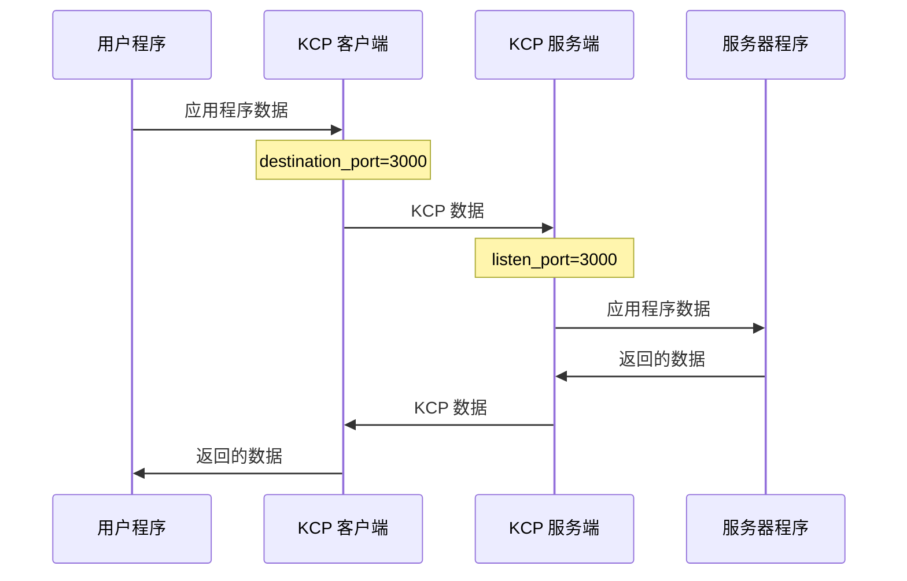

# KCP Tube 常规配置

## 最基础的配置文件
这是最为基础的配置文件，可以按照个人需求修改相应配置。

在这个模式，服务端只提供单个端口连接。但为了尽量躲避 QoS，客户端仍然会尝试每隔 1 分钟就换一次发送端口（除非 dport_refresh 设为 0 主动禁用）。

客户端模式示例：
```
mode=client
kcp=regular3
inbound_bandwidth=500M
outbound_bandwidth=50M
listen_port=59000
destination_port=3000
destination_address=123.45.67.89
encryption_password=qwerty1234
encryption_algorithm=AES-GCM
```

服务端模式示例：
```
mode=server
kcp=regular3
inbound_bandwidth=1G
outbound_bandwidth=1G
listen_port=3000
destination_port=59000
destination_address=::1
encryption_password=qwerty1234
encryption_algorithm=AES-GCM
```

流程：

## 动态端口模式

在这个模式，服务端指定一段连续的端口范围，客户端在连接时随机选择其中一个端口号建立连接，随后每隔 1 分钟就换一个端口号。

客户端模式示例：
```
mode=client
kcp=regular3
inbound_bandwidth=500M
outbound_bandwidth=50M
listen_port=6000
destination_port=3000-4000
destination_address=123.45.67.89
dport_refresh=600
encryption_password=qwerty1234
encryption_algorithm=AES-GCM
```

服务端模式示例：
```
mode=server
kcp=regular3
inbound_bandwidth=1G
outbound_bandwidth=1G
listen_port=3000-4000
destination_port=6000
destination_address=::1
encryption_password=qwerty1234
encryption_algorithm=AES-GCM
```

如果想要 5 分钟（即 600 秒）才更换端口，那么可以在客户端配置文件内加上 `dport_refresh=600`。

初次连接时，服务端会向客户端告知自己的端口范围，因此客户端模式的 `listen_port` 不一定要等于服务端模式的 `destination_port`，两边的端口可以不一致，但客户端所写的端口号范围不能超出服务端的范围，以免客户端选错端口连接不上。

## 使用 STUN 打洞

如果服务端位于 NAT 后方，那么可以在服务器端的配置文件内填入 STUN 服务器地址。

```
mode=server
kcp=regular3
inbound_bandwidth=1G
outbound_bandwidth=1G
listen_port=3000
destination_port=59000
destination_address=::1
encryption_password=qwerty1234
encryption_algorithm=AES-GCM
stun_server=stun.qq.com
log_path=./
```

注意：使用 STUN 打洞时，服务端无法侦听多端口，只能使用单端口模式；不支持自定义侦听地址。因为 STUN 打洞后获得的端口号并不固定，即使服务端自己的端口范围是连续的，打洞时无法保证获得的端口号范围也是连续的。因此这种模式下 KCPTube 限制为只能使用单端口模式。

## 指定侦听网卡

客户端及服务端都可以指定侦听的网卡，只须指定该网卡的 IP 地址。加一行即可

```
listen_on=192.168.1.1
```

或者多个地址

```
listen_on=192.168.1.1,172.16.20.1
```

## 多个目标地址

客户端及中继模式都可以指定多个目标地址，这些地址必须指向同一个服务端。

```
destination_address=127.0.0.1,::1,10.200.30.1
```

**备注**：使用多地址时，建议客户端的 `destination_address` 与服务端的 `listen_on` 保持一致。

如果服务端的 `listen_on` 未填写，那么在填写客户端 `destination_address` 时需要确保每个地址都处于不同的网段。

例如，客户端填写 `destination_address=192.168.0.1,FDCA:1234::1`，那么可以不填写服务端的 `listen_on`，因为`192.168.0.1`、`FDCA:1234::1`必然不是同一个网段。

如果客户端填写 `destination_address=192.168.0.1.192.168.0.2,FDCA:1234::1,FDCA:1234::2`，那么最好在服务端的 `listen_on` 那里指定这几个地址，以免数据包从意想不到的地址发出去。

## 不连续端口范围

若需要使用非连续端口范围，可以使用逗号分隔

### 服务端

```
listen_port=13000-13050,14000-14050,15000
```

### 客户端
```
destination_port=13000-13050,14000-14050,15000
```

## 自己指定 KCP 选项

如果想要更细致的设置，可以自己指定 KCP 选项。

客户端模式示例：
```
mode=client
kcp=manual
kcp_mtu=1400
kcp_sndwnd=512
kcp_rcvwnd=2048
kcp_nodelay=1
kcp_interval=10
kcp_resend=2
kcp_nc=true
udp_timeout=300
listen_port=6000
destination_port=3000-4000
destination_address=123.45.67.89
dport_refresh=600
encryption_password=qwerty1234
encryption_algorithm=AES-GCM
```

服务端模式示例：
```
mode=server
kcp=manual
kcp_mtu=1400
kcp_sndwnd=512
kcp_rcvwnd=2048
kcp_nodelay=1
kcp_interval=10
kcp_resend=2
kcp_nc=true
udp_timeout=300
listen_port=3000-4000
destination_port=6000
destination_address=::1
encryption_password=qwerty1234
encryption_algorithm=AES-GCM
```

## 多个配置文件

如果想要侦听多个端口、多个网卡，那就分开多个配置文件，然后同时使用

```
kcptube config1.conf config2.conf
```