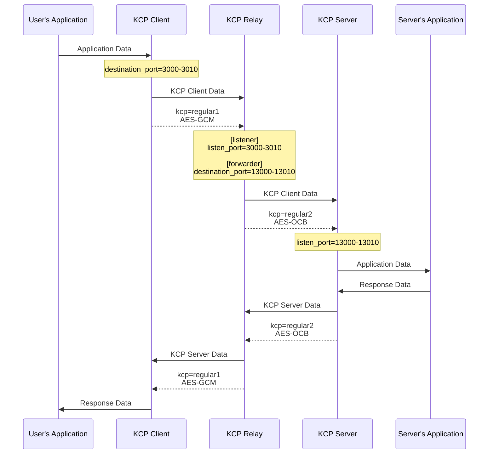

# KCP Tube Relay Mode Configurations

## Configuration file example

Example of client mode:
```
mode=client
kcp=regular1
inbound_bandwidth=500M
outbound_bandwidth=50M
listen_port=59000
destination_port=3000-3010
destination_address=123.45.67.89
encryption_password=qwerty1234
encryption_algorithm=AES-GCM
```

Example of relay mode:
```
mode=relay

[listener]
kcp=regular1
inbound_bandwidth=300M
outbound_bandwidth=300M
listen_port=3000-3010
encryption_password=qwerty1234
encryption_algorithm=AES-GCM

[forwarder]
kcp=regular2
inbound_bandwidth=300M
outbound_bandwidth=300MM
destination_port=13000-13010
destination_address=87.65.43.21
encryption_password=qwerty1234
encryption_algorithm=AES-OCB
udp_timeout=10
```

Example of server mode:
```
mode=server
kcp=regular2
inbound_bandwidth=1G
outbound_bandwidth=1G
listen_port=13000-13010
destination_port=59000
destination_address=::1
encryption_password=qwerty1234
encryption_algorithm=AES-OCB
```

As you can see, the KCP settings and encryption options for the client and server are different.

That's right, you only need to correctly configure the channels on both sides of the relay station, and the relay node will re-encrypt when forwarding.

Process:


## Shareable options for Configuration Files

The following configuration options can be used outside `[listener]` and `[forwarder]` sections:
- kcp
- kcp_rcvwnd
- kcp_sndwnd
- outbound_bandwidth
- inbound_bandwidth
- encryption_password
- encryption_algorithm
- udp_timeout
- keep_alive
- ipv4_only=1

If these options appear outside of sections label, they override all corresponding values inside the section label. Among them, `ipv4_only=1` is a special case, it is only covered when `ipv4_only=1`, and it is not covered when `ipv4_only=0`.

Because `ipv4_only=0` means to use the default setting, that is, dual-stack mode.

For example, you can write:
```
mode=relay
kcp=fast1
outbound_bandwidth=300M
inbound_bandwidth=300M
encryption_password=qwerty1234
encryption_algorithm=AES-GCM

[listener]
listen_port=3000-3010

[forwarder]
destination_port=13000-13010
destination_address=127.0.0.1
```

If the KCP settings of the entire link are the same, it is really convenient to do so.

## Notes
If you need to configure `udp_timeout` yourself, please ensure that the `udp_timeout` of the relay node is greater than or equal to the `udp_timeout` value of the server and client to avoid prematurely clearing the forwarding link.

## About the Section Tags
When configuring relay mode, it is necessary to clearly write the section labels of the two nodes - `[listener]` and `[forwarder]`, which cannot be ignored.